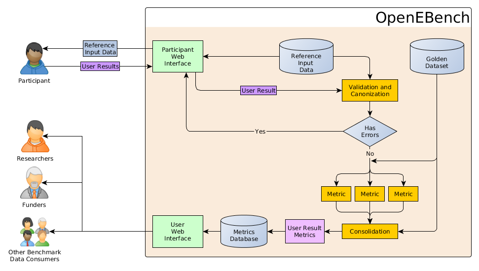

## Community instructions

Communities that aim to integrate with our pipeline for benchmarking should provide several information and docker images. We provide examples of these docker images using toy benchmarks, which are available under the repository folder 'sampleContainers'.

### Community workflow activity



### The Community has to provide

* __Specification of the workflow__
  * __Query Standard.__ The community must provide the convention of the query datasets that will be sent to the participants.

  * __Reference Dataset Standard.__ Some benchmarking events require to set up reference datasets, like specific versions of databases available to use, so the obtained results from all the participants are comparable.

  * __Result standards.__ The participants must provide the results in one of the accepted standards established by the community.
The community must define at least one canonical format.

  * __Mapping of error codes.__
When one of the dockers fails, it should produce a UNIX exit code different from 0. When a docker image fails, this code will be stored to the database along with the STDERR output.
It is responsibility of the community to provide useful information regarding these errors, so their users are able to understand the problems found.
Communities are compelled to define a structured error format, shared by all the used dockers.

* A __results data validation docker__: This docker will check the syntax of the submitted results from participants. If the community allows results in more than one format, this docker image has to translate these results to the canonical format. This docker is responsible of checking common issues as format is not allowed or recognized, some file is corrupted or it could not be translated to the canonical format.

  *It is responsibility of the community to provide useful information regarding these errors, so their users are able to understand the problems found.*

  * Input: Original participant results.
  * Output: Participant results in canonical format or error code and STDERR error message.

* A __query IDs extraction docker__: This docker will extract IDs from the query sent to the participants, and it is run only once per test event.
  The output of this docker should be a file in JSON format, containing a list of objects with the next structure:

  * *Input*: Test event identifier, and query that will be sent to participants
  * *Output*: JSON containing all the IDs available in the Query.
  * *Schema*:
	```json
	{
		"testEventId": "anEventId",
		"queryIds": [
			"ID-1",
			"ID-2",
			"ID-3",
			...
		]
	}
	```
* A __result IDs extraction docker__: This docker will extract IDs from the canonical format. The output of this docker should be a file in JSON format, containing a list of identifiers and the testEvent ID. These identifiers should be a subset of the Query IDs of the testEvent.
These IDs will be compared to the Query Dataset an report an error if there are IDs that are not present on the Query dataset.

  * *Input*: Test event identifier, and participant results in canonical format.
  * *Output*: JSON list containing IDs.
  * *Schema*:
	```json
	{
		"testEventId": "anEventId",
		"resultIds": [
			"ID-1",
			"ID-3"
		]
	}
	```

* One or more __metrics computation dockers__ : These docker images should calculate the statistics based on the participant results in canonical format and reference data. Each docker should produce a statistic.

  * *Input*:
    * Participant results in canonical format.
    * Reference data.
    * Query IDs.
    * Results IDs.
  * *Output*: Statistic calculated.

  *It is responsibility of the community to provide a useful output.*

* One __metrics consolidation docker__ : This docker is a secondary docker that will receive all previous metrics as input. This allows to perform some post-processing of the statistics, or secondary statistics that may need to use previous statistics.

 Some communities may want to apply some *penalization* in case the participant has not provided results for all the entries in the Query Dataset, this is the recommended place to perform those penalizations.
*This container is not mandatory.*

  * *Input*:
    * Participant results in canonical format.
    * Output from previous statistics calculated.
    * Reference data.
    * Query IDs.
    * Results IDs.
  * Output: Final statistic.
	*It is responsibility of the community to provide a useful output.*

<!--- TODO
### How to upload to the platform.
--->

