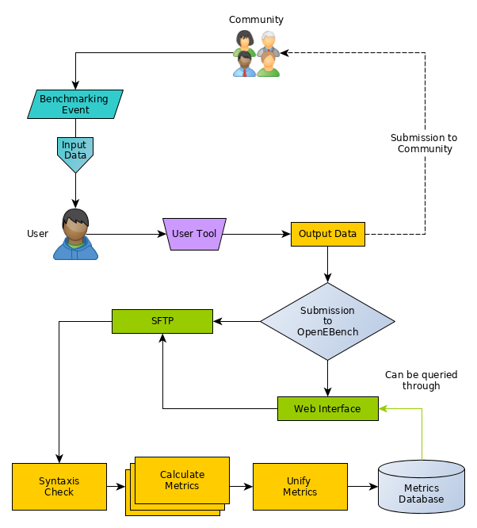

## User instructions

We are working with Scientific Communities to define the protocol for users to prepare their software containers e.g. dockers, to be submitted to OpenEBench.
Shoortly we will provide more information on this regard.

### User workflow activity

