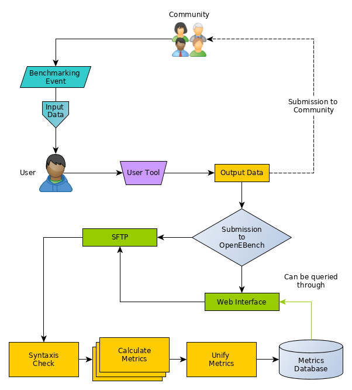

# Introduction
As it is identified in [doi.org:10.1101/181677](http://dx.doi.org/10.1101/181677), scientific communities try to speed up the advancements in their areas through benchmark and community challenges. In order to reach these goals, the coordinators of the community must provide:

1. An standardization for the datasets, a set of good practices and guidelines.

2. Unbiased query sets to challenge the participants' tools, which can become reference data sets.

3. Relevant metrics, agreed by the community, for measuring tools performance.

4. Unbiassed assessments of the results obtained from the different participants. at scientific and technical levels.

5. A way to share query sets, reference data sets and metrics among the members of the community.

6. A way to share the computed metrics of the results obtained from all the participants.

# User instructions

## User workflow activity

{: .image-center}

### Benchmarking event

#### New dataset

### Web interface

### SFTP

#### Sintaxis Check

#### Calculate Metrics

#### Unify metrics

# Community instructions
## Community
### OpenEBench submission server internal behaviour

{: .image-center}

